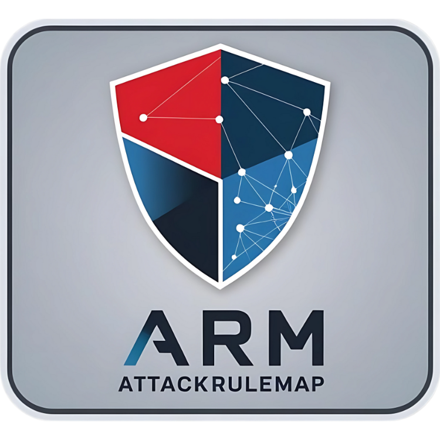

#  AttackRuleMap

This repository provides a mapping of Atomic Red Team attack simulations to open-source detection rules, such as Sigma and Splunk ESCU.

### [Go to AttackRuleMap](https://attackrulemap.com)

## 🎯 Project Purpose
The goal of this project is to bridge the gap between Atomic Red Team's adversary simulations and open-source detection rules. By doing so, this project aims to help security professionals simulate attacks and evaluate their detection strategies more effectively. 🔒

## 🛠️ Project Origin
This project is the result of a simulation conducted in my personal lab environment. During the simulation, I executed all available Atomic Red Team tests and ran all [Sigma](https://sigmahq.io/) and [Splunk ESCU](https://research.splunk.com/detections/) detections. 

### Environment Setup
- **Operating System:** Windows Server 2019 running in a virtualized environment.
- **Testing Tool:** Atomic Red Team, executed using PowerShell and manual adjustments for specific scenarios.
- **Log Ingestion:** Splunk Enterprise for ingesting logs and analyzing detections.
- **Datamodel Acceleration:** To running all searches multi-threaded requires datamodel acceleration.
- **Detection Rules:** Sigma rules and Splunk ESCU rules.

The outputs from these tests form the foundation of this repository. It focuses on Windows systems for now. Future updates may include support for additional platforms. 💻

Note: The mapping process is a mix of manual and automatic. It is a time consuming process. But I will still try to update it monthly.

## 🔄 Sigma Rule Conversion
To convert Sigma rules into Splunk Search Processing Language (SPL), I used the [sigconverter.io](https://sigconverter.io) locally on Docker. This tool simplifies the process of adapting Sigma rules for use in Splunk by automating the translation process. Users can specify the desired target platform, such as Splunk, Elastic, Kusto or any platform that supported by sigconverter, and the tool generates platform-specific queries based on Sigma's rule definitions.

## 🤝 Contribution
This project is open to contributions from the community. Here are some ways you can contribute:

- **Platform Testing:** Test and validate the detection rules on non-Windows platforms, such as Linux or macOS.
- **Feedback and Suggestions:** Share your ideas for improving the project or addressing potential gaps.

If you'd like to contribute, feel free to submit a pull request or open an issue. 💡
